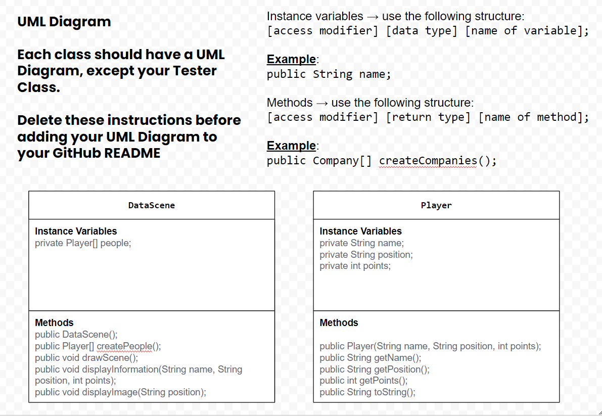
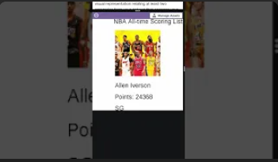

# Unit 4 - Abstract Art Project

## Introduction

Data visualizations are powerful tools to present information and convey patterns and relationships. Sometimes visualizations are charts or graphs, and other times they are more abstract pieces of art. Your goal is to create a visual representation relating at least two categories from your dataset that engages your viewer and encourages them to learn more about your chosen topic.

## Requirements

Use your knowledge of object-oriented programming, one-dimensional (1D) arrays, and algorithms to create your data visualization program:

- **Create at least two 1D arrays** – Create at least two 1D arrays to store the data that will make up your visualization.
- **Implement one or more algorithms** – Implement one or more algorithms that use two-way or multi-selection statements with compound Boolean expressions to analyze the data.
- **Use methods in the Math class** – Use one or more methods in the Math class in your program, such as to perform calculations on the values in your dataset and display the results, choose random values from the dataset, or display images or shapes at random locations.
- **Create a visualization** – Create an image or animation that conveys the story of the data by illustrating the patterns or relationships in the data.
  Note: This may be abstract! Others do not necessarily need to know what the story or pattern is right away, but you do need to be able to explain it to them.
- **Document your code** – Use comments to explain the purpose of the methods and code segments and note any preconditions and postconditions.

## Dataset

Include a hyperlink to the source of your dataset used for this project. Additionally, provide a short description of each column used from the dataset, and the data type.

Example:

Dataset: https://www.kaggle.com/datasets/isaienkov/nba-top-50-alltime-scorers

- **player** (String) - name of the NBA Player
- **position** (String) - Position of the NBA Player on the court
- **total_points** (int) - Points scored by the NBA Player

## UML Diagram

## Video Demo

Record a short video of your abstract art animation to display here on your README. You can do this by:

- Screen record your project running on Code.org.
- Upload that recording to YouTube.
- Take a thumbnail for your image.
- Upload the thumbnail image to your repo.
- Use the following markdown

## Description

As a high school basketball player, I want to see which NBA position is most frequently found on the Top 50 All-Time Scoring List. Based on this data, I will decide which position I want to choose so I can be the lead scorer on my high school basketball team. I used 1D Arrays for the name of the NBA Player, the points they scored, and their position on the court. I then created a new Array with the length of the name Array, then iterated through that and created a new Player object that sent in the arguments, the name of the NBA Player, points scored, and their position on the court all at that index. Then in the drawScene function I got this information using the accessor methods of the Player.java Class and displayed this information using the displayInformation function. I also made the image dynamically change based on NBA player's court position, with the images showing popular NBA players who played that most commonly played that position in their NBA careers. 